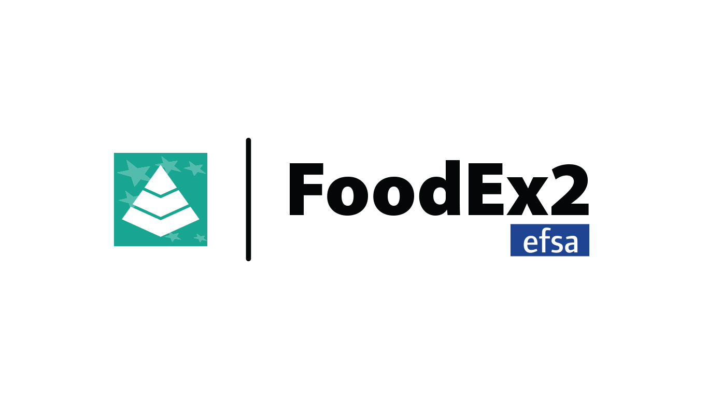

# Project Under Development

<p align="center">
	
</p>

## FoodEx2 Smart Coding Application - Frontend
The FoodEx2 Smart Coding Application is designed and developed internally in the European Food Safety Authority (DATA and AMU units). The frontend of the FoodEx2 Smart Coding Application is fully open source and aims to simplify coding in FoodEx2 by making use of free text food and feed description. More specifically, the application is composed of several web components which allow interfacing with the APIs available on the backend. Please note that the components can also be extracted and hence used outside the scope of the application itself (e.g. in another web platform).

<p align="center">
    
</p>

## For Developers
### Prerequisites
* [Git](https://git-scm.com/download/)
* [Node.js](https://nodejs.org/en/)
* [npm](https://www.npmjs.com/)

### Install Polymer CLI
After installing the prerequisities listed above, run the following command in order to install the Polymer CLI globally:
```
npm install -g polymer-cli
```

### Clone and install
Clone the project locally in your workspace using the following command:
```
git clone https://github.com/openefsa/foodex2-sca-frontend.git
```

Now, move inside the project's folder just cloned and install all the required dependencies (listed in the package.json file). Run the following command in order to automatically install all the dependencies using npm:
```
npm install
```

### Serve FoodEx2 SCA locally
In order to view the app on the browser, it is needed to serve the project using Polymer. Run the following command from the project's folder:
```
polymer serve
```

Click on the link which will appear on the terminal; this will automatically open a new page in the browser and hence render all user interface components.

*Please note that FoodEx2 Smart Coding Application fully support the latest version of Chrome and Firefox.*

## Web components
The fronted for the FoodEx2 Smart Coding Application has been developed starting from the base class provided by [Lit-Element](https://lit-element.polymer-project.org/) (from Polymer project). Each component has been built starting from the base Lit-Element class and hence connected to each other following the Polymer 3 framework requirements.

In this section we describe the various web components that make up the home page of FoodEx2 SCA. These, in fact, have been designed exclusively to follow the web component directives and therefore allow reusability outside of this project.

*Please note that the web components are using pre-built paper-elements available from Polymer at the following [link](https://www.webcomponents.org/collection/PolymerElements/paper-elements). In particular circumstances, custom elements have been developed in order to meet the system requirements.*

### input-component
This web component consists of an input field and a button. The input field allows the insertion of a free text that, in the case of the FoodEx2 SCA project, should describe a particular, simple or compound, food or feed (e.g. *"chocolate"* or *"white chocolate with hazelnuts"*). The *"SEND"* button, situated just next to the input field, allows to get the content of the input field and hence create and make a GET request to the backend API. More specifically the GET request is built using the free text description and a threshold value (which filter those terms not having the same or greather percentage of accuracy). Here is the structure of the GET request called when the *"SEND"* button is pressed:
```
GET http://hostname:port/predictAll HTTP/1.1
content-type: application/json

{
    "text":"white chocolate",
    "threshold": "0.1"
}
```
If the request is handled correctly from the backend API, this will return a JSON object containing:
* list of base terms,
* list of facet categories,
* for each category the list of facets that can be applied to it.

#### Input Data
* None.
#### Output Data
* Data {Object}: JSON data file containing list of base terms, facet categories and list of facets for each category (check the [backend](https://github.com/openefsa/foodex2-sca-backend) for additional information.)

### baseterms-component
This web component contains a section that is populated by a series of so-called tags. The tags are arranged horizontally with respect to the section and can be scrolled through the navbar, located at the bottom, or through the shortcut ctrl+mouse wheel (or multi-touch gestures).

Each tag has the characteristic of having a grey background color by default. Instead, if the term is selected a **blue** background color will be applied. Inside each tag is shown the name of the term returned from the backend API as well as an inner-tag that allows to know the percentage with which the models are sure about the suggestion made. In addition, you can learn more information about each tag by hovering the cursor on the tag. By doing so, a mini window will appear showing the name, the code and the percentage of accuracy for the specific term. In this section all the tags are sorted in descending order by percentage of accuracy. Please use the specific web component propety if the auto selection of the first lef-term is requested.

#### Input Data
* Baseterms {Object}: list of base terms suggested
#### Output Data
* Selected baseterm {Term}: object containing the term selectd.

### facets-component
This web component contains a section that is populated by a series of so-called tags. The tags are arranged horizontally with respect to the section and can be scrolled through the navbar, located at the bottom, or through the shortcut ctrl+mouse wheel (or multi-touch gestures).

Differently from the *baseterms-component*, the *facets-component* has a drop-down list which allows the selection of the facet category of interest. At each facet category selection an event is raised which refresh the section below with the list of tags that can be applied to it. Each tag has the characteristic of having a grey background color by default. Instead, if one or more terms are selected a **green** background color will be applied. Inside each tag is shown the name of the term returned from the backend API as well as an inner-tag that allows to know the percentage with which the models are sure about the suggestion made. In addition, you can learn more information about each tag by hovering the cursor on the tag. By doing so, a mini window will appear showing the name, the code, the category to which it belongs to and the percentage of accuracy for the specific term. In this section all the tags are sorted in descending order by percentage of accuracy. Please use the specific web component propety if the auto selection of the terms is requested.

#### Input Data
* FacetData {Object}: list of categories and facets.
#### Output Data
* Selected facets {List`<Facet>`}: object containing the facets selectd.


### overview-component
The *"overview-component"* is a section that collects the whole list of tags selected in the *"baseterms-component"* and *"facets-component"*. This, is particularly useful especially in the selection of facets as it allows to have an overview of all the selected facets for each category.

#### Input Data
* Selected Baseterm {Term}: term object populated with the properties of the chosen base term.
* Selected Facets {List`<Facet>`}: list of facet objects populated with the properties of the chosen facets.
#### Output Data
* None.

### code-component
This component is updated every time the user interacts with the *"baseterms-component"* and *"facets-component* and allows to obtain the FoodEx2 code generated.

#### Input Data
* Selected Baseterm {Term}: term object populated with the properties of the chosen base term.
* Selected Facets {List`<Facet>`}: list of facet objects populated with the properties of the chosen facets.
#### Output Data
* None.

### feedback-component
The feedback component allows, through a specific button, to access a dialog box which exposes a series of features that allow the submission of feedback. Please note that this functionality is restricted to a limited number of users. The user, after logging in, will notice a new control button at the bottom of the homepage which, if pressed, will allow the feedback window to open. In this window we find two input fields, one dedicated to the description of the food or feed and one dedicated for the coding in FoodEx2 system. In addition, on the lower right side, there are 3 command buttons that allow us to reset the input fields, cancel the feedback operation or accept the feedback (POST request in backend).

An example of the POST request submitted to the backend looks like the following:
```
OST http://127.0.0.1:5000/postFeedback HTTP/1.1
Content-Type: "application/json"
x-access-token: mysecretkey

{
    "desc": "hazelnuts",
    "code": "A034L"
}
```

#### Input Data
* Description {String}: food/feed description typed in the *"input-component"*.
#### Output Data
* None.

## Deployment
The following section describes how to deploy the FoodEx2 Smart Coding application locally.

### Docker build
Install [Docker](https://docs.docker.com/get-docker/) and configure it on your local computer. From the main folder of the foodex2-sca-frontend project run the following command:
```
docker build -t name:tag
```

This command will use the **DOCKERFILE**, present in the main folder, for creating the docker image. Check if the docker image is present by launching the following command:
```
docker images
```

After making sure that the docker image has been correcly created, run it with the following command:
```
docker run name:tag
```

### Kubernetes deployment
Deploy the docker image created on kubernates by using the files present under the *"/manifest"* folder by running the following command:
```
kubectl deploy -f create ./manifest/deployment.yml
```